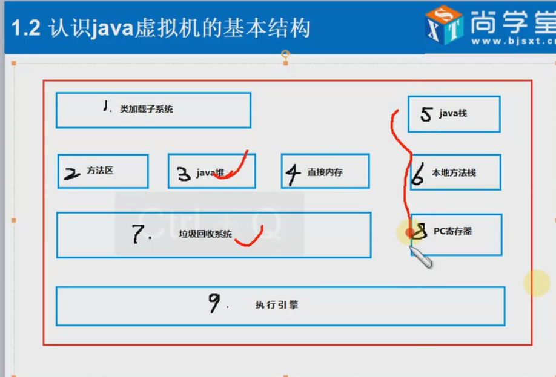
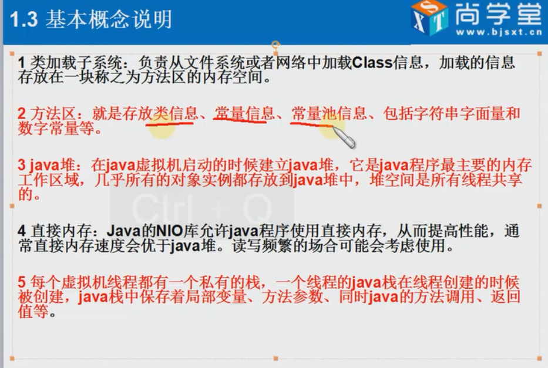
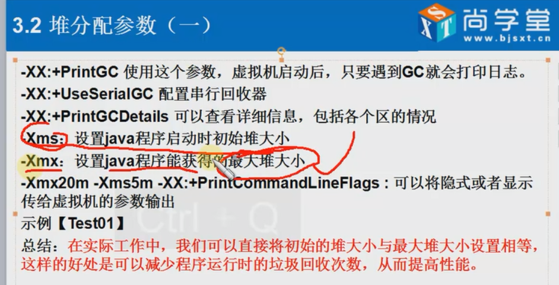
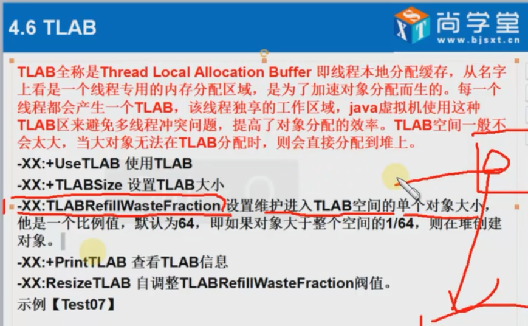
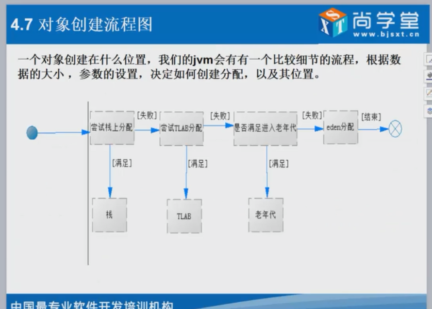

### JVM 虚拟机优化

### 虚拟机

+ 系统虚拟机
+ 程序虚拟机

### 虚拟机基本结构

#### 堆

+ 是自动化管理的
+ 一般分为新生代和老年代两大区域新生代存储新生对象或者年龄较小的对象信息老年代则相反
+ 新生代又分为Eden区 s0区 s1区 也成为form和to区 他们是两块大小相等并且可以互换较色的区域
  + s0 s1
  + 对象刚出生被分配到Eden区 经历过一次GC的回收后可能会进入到s0区或者s1区 这两个区域采用的复制算法 在这里面如果某一些对象经历过15次GC的回收之后 就会被放到老年代 相对来说生命周期比较长

#### 栈

+ 是线程私有的  每一个线程都会开辟一个栈空间
+ 详细划分为 局部变量表 操作数栈  帧数据区
+ 操作数栈
  + 主要保存一些程序计算的结果  或者是作为变量的临时存储空间
+ 局部变量表
  + 用户一些局部变量和报错函数的参数
+ 帧数据区
  + 来支持常量的解析 保存着访问常量池的指针 方便程序访问常量池

#### 方法区

+ 被所有线程共享
+ 存储一些静态常量 变量 方法 
+ 方法区可以理解为永久区

#### 虚拟机参数

+ 堆分配参数
  + -XX:PrintGCDetails   打印明细信息
  + -XX:PrintGC   打印GC
  + -XX:+UseSerialGC    使用串行GC
  + -Xms20m    GC初始启动时分配的堆内存
  + -Xmx50m    最大分配堆内存
  + -XX 代表的是系统级别的配置 一般会打印日志 只要使用到了GC
  + 非-XX的就是应用级别的配置参数
  +  \+ 代表启用     - 代表禁用

表示 -XX:PrintGC 已经弃用  使用 -Xlog:gc

+ 可以根据不同的生产环境 进行优化

#### 编辑工具的使用

+ word
+ excel
+ visi
+ 这些工具在以后走管理的时候是非常重要的